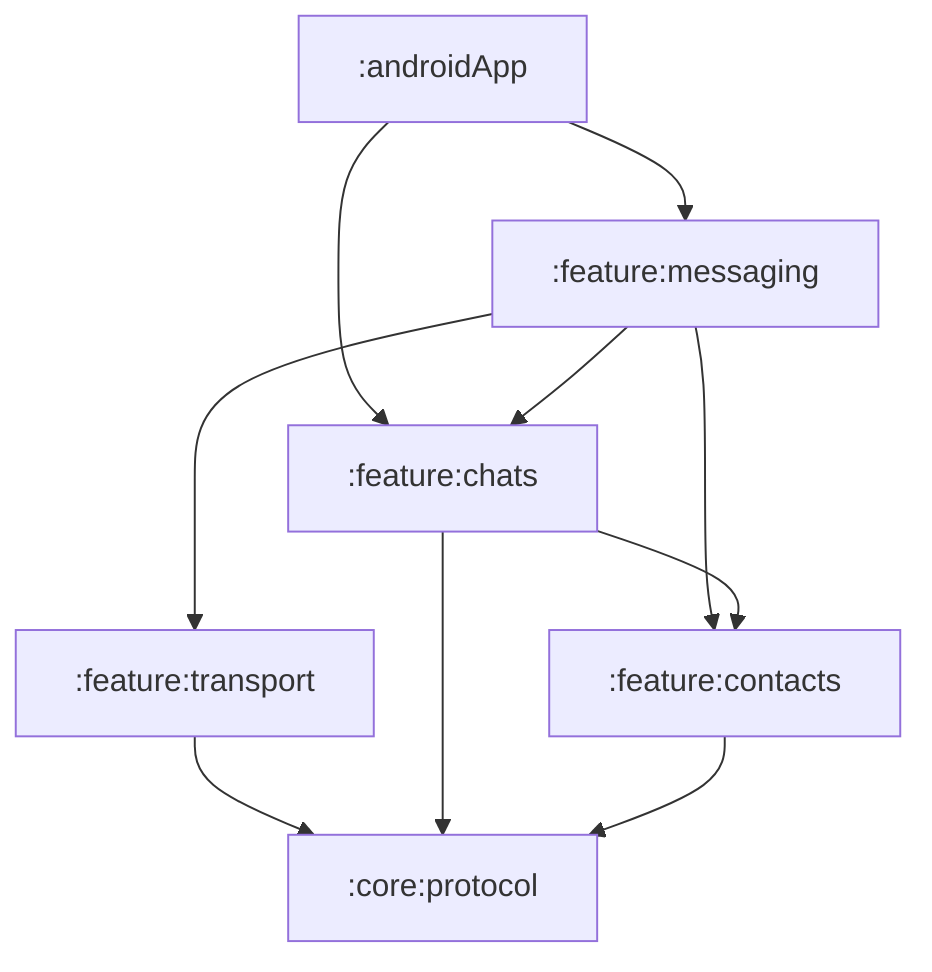

# Messaging Boundary

SecureChat separates messaging orchestration from transport mechanics and chat storage.

## Module ownership

| Module | Owns | Does not own |
|---|---|---|
| `:feature:transport` | WebSocket client, relay connection, wire sender, relay codecs | Contacts, chat repositories, outbox orchestration |
| `:feature:messaging` | Incoming relay runner, outbox application flow, relay/contact resolution, typing adapter | Compose UI, conversation persistence rules |
| `:feature:chats` | Conversations, messages, receipts, delivery state, chat UI | WebSocket lifecycle and relay routing |
| `:feature:contacts` | Contacts, device-contact ports, identity verification | Relay/WebSocket implementation |
| `:feature:identity` | Local identity, identity storage ports, sharing codec contract | Chat or relay orchestration |

## Dependency direction

`:feature:transport` must remain unaware of feature repositories and the database. `:feature:messaging` is the application-level composition boundary that connects transport ports to chats and contacts.

## Application flow

Outgoing packets are persisted by chats, observed and prepared by messaging, and transmitted by transport. Incoming relay envelopes are collected by messaging, then handed to the `IncomingMessageHandler` implemented by chats.

The `ChatsRepository` API contains conversation operations only. Encoded transport payloads and local private keys must not be added to it.

## Presentation rule

ViewModels call use cases. They do not inject repositories, storage ports, cryptographic generators, or transport gateways directly.
