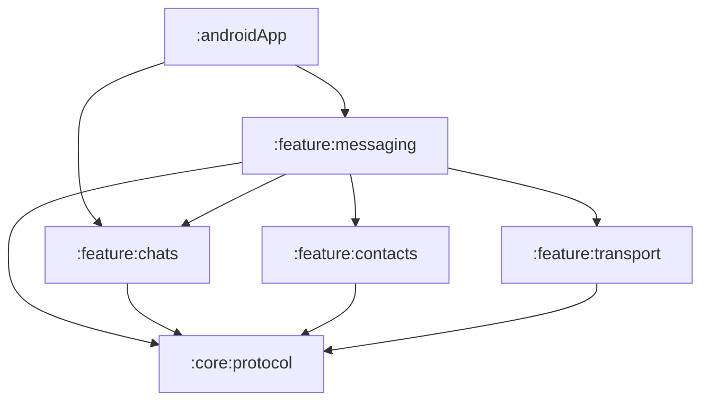
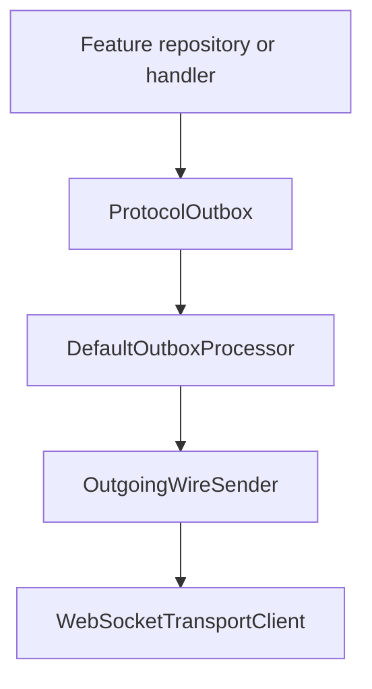
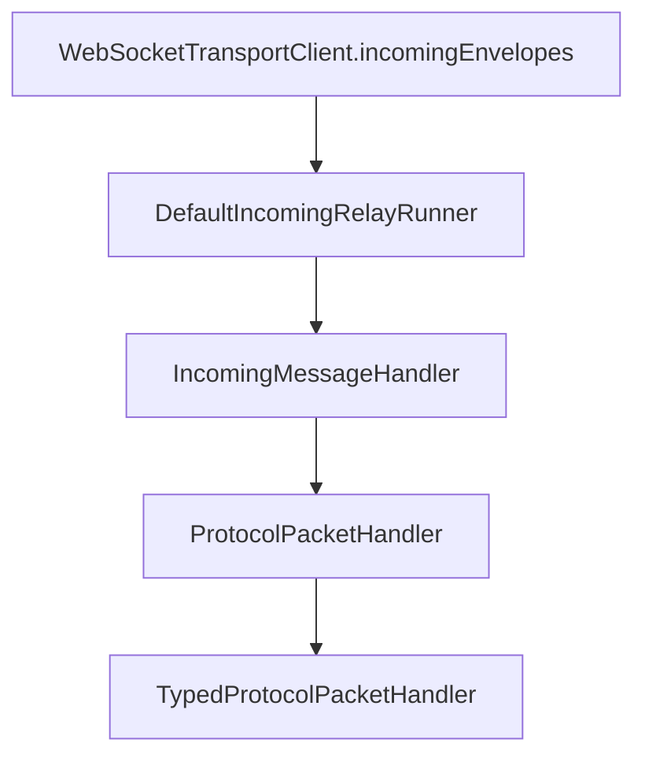

# Messaging Boundary

Messaging spans several modules, but each concern has one owner. The most important distinction is:

> `:feature:messaging` coordinates a message operation; `:feature:transport` moves opaque data.

The detailed runtime trace is in
[Messaging and Delivery Flow](../features/message-transport-flow.md).

## Ownership map

| Concern | Owner | Main classes |
|---|---|---|
| Conversation and message behavior | `:feature:chats` | `DefaultChatsRepository`, `DirectConversationStore` |
| Group invitation consent and activation | `:feature:chats` | `GroupInvitationCoordinator`, `GroupInvitationManager`, `GroupInvitationDao`, `GroupMessageSender` |
| Group epoch security | `:feature:chats` | `GroupSecurityManager`, `GroupProtocolPayloadEncoder`, `AndroidGroupKeyStorage` |
| User-visible delivery state | `:feature:chats` | `MessageDeliveryStateMachine`, `MessageDeliveryStateCoordinator` |
| Incoming packet behavior | Feature that understands the packet | `ChatMessagePacketHandler`, group invite/join/decline/welcome/ready handlers, `IdentityPacketHandler` |
| Packet model and dispatch contracts | `:core:protocol` | `SecureChatPacket`, `PacketCodec`, `ProtocolPacketHandler`, `TypedProtocolPacketHandler` |
| Persistent outgoing queue contract | `:core:protocol` | `ProtocolOutbox`, `OutboxStateMachine` |
| Persistent outgoing queue implementation | `:data:database` | `DefaultProtocolOutbox`, `ProtocolOutboxDao` |
| Send/receive orchestration | `:feature:messaging` | `DefaultOutboxRunner`, `DefaultOutboxProcessor`, `DefaultIncomingRelayRunner` |
| Contact/relay address mapping | `:feature:messaging` | `DefaultContactRelayIdResolver`, `DefaultContactByRelayIdResolver` |
| Typing adapter | `:feature:messaging` | `RelayTypingIndicatorGateway` |
| WebSocket and reconnect mechanics | `:feature:transport` | `DefaultWebSocketTransportClient`, `DefaultRelayConnectionManager` |
| Wire sender adapter | `:feature:transport` | `WebSocketOutgoingWireSender` |
| Relay storage and routing | `:relay` | `RelayWebSocketHandler`, `DefaultRelayEnvelopeRouter`, `InMemoryPendingEnvelopeStore` |
| Process startup | `:androidApp` | `SecureChatApplication.startRuntimeServices()` |

## Dependency direction



The generated report shows the exact dependencies. The boundary rules behind the graph are:

- `:core:protocol` defines stable contracts without depending on features.
- `:feature:chats` and `:feature:contacts` own packet meaning and register typed handlers.
- `:feature:transport` never loads a contact, conversation, Room entity, or protocol packet.
- `:feature:messaging` is allowed to depend on chats, contacts, transport, crypto, protocol, and
  database because its job is to coordinate those boundaries.
- `:androidApp` starts long-running services but does not implement their behavior.

## Outgoing boundary

The originating feature creates a `SecureChatPacket` and calls `ProtocolOutbox.enqueue()`. From that
point, the messaging runtime owns the attempt:



This lets chat, receipt, group, and identity packets use one persistent send pipeline. Feature code
does not need to know whether the current wire transport is WebSocket-based.

## Incoming boundary

The transport client exposes an opaque `RelayEnvelope`. Messaging resolves the sender and obtains
the local decryption keys, then crosses the protocol boundary:



`IncomingMessageHandler` is implemented by `IncomingMessageProcessor` in `:feature:chats`. The name
reflects the pipeline entry point; after decoding, `DefaultProtocolPacketHandler` may dispatch to
handlers owned by chats or contacts.

The relay envelope is acknowledged only after the complete handler call succeeds. This is a
reliability boundary, not just a networking detail.

## Package layout

`:feature:messaging` is intentionally UI-less:

```text
feature/messaging/.../feature/messaging/
├── application/
│   ├── incoming/
│   │   ├── IncomingRelayRunner.kt
│   │   └── DefaultIncomingRelayRunner.kt
│   └── outbox/
│       ├── DefaultOutboxProcessor.kt
│       └── DefaultOutboxRunner.kt
├── domain/
│   └── relay/
│       ├── ContactRelayIdResolver.kt
│       └── ContactByRelayIdResolver.kt
├── data/
│   ├── relay/
│   │   ├── DefaultContactRelayIdResolver.kt
│   │   └── DefaultContactByRelayIdResolver.kt
│   └── typing/
│       └── RelayTypingIndicatorGateway.kt
└── di/
    └── MessagingModule.kt
```

Application classes own long-running workflows. Domain interfaces describe address-resolution
ports. Data classes implement those ports using contacts, Room, or transport.

## Rules for future code

Place new code according to the decision it makes:

- If it decides what a chat action means, put it in `:feature:chats`.
- If it manages group epochs, membership key snapshots, or group payload authentication, put it in
  `:feature:chats/data/security`.
- If it decides what a contact or identity exchange means, put it in `:feature:contacts`.
- If it coordinates persisted packets, crypto, addressing, and the wire, put it in
  `:feature:messaging`.
- If it only opens connections, serializes relay frames, or sends opaque payloads, put it in
  `:feature:transport`.
- If it defines a transport-independent packet or port, put it in `:core:protocol`.
- If it stores Room entities or implements the persistent outbox, put it in `:data:database`.
- If it routes opaque envelopes between processes, put it in `:relay`.

Do not add transport payloads or private key parameters to `ChatsRepository`, and do not make
ViewModels depend on `WebSocketTransportClient`, DAOs, or crypto implementations.
