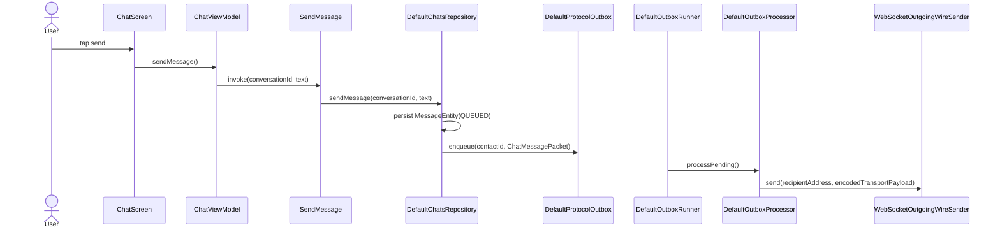
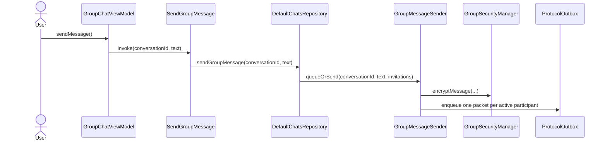

# Conversation, Messaging, and Delivery Flow

This document follows the production call chain for direct and group conversations. Class and
function names are the names used by the current source code.

For module ownership, read [Messaging Boundary](../architecture/messaging-boundary.md).

## Representations and ownership

| Representation | Important types | Owner |
|---|---|---|
| Conversation UI | `ChatUiState`, `ChatMessageUi`, `GroupVerificationSummaryUi` | `:feature:chats` |
| Persistent chat data | `ConversationEntity`, `MessageEntity`, `MessageRecipientStateEntity` | `:data:database` |
| Protocol work | `SecureChatPacket`, `ProtocolOutboxItem` | `:core:protocol` |
| Transport payload | `EncryptedTransportPayload`, `TransportEncryptionMode` | `:core:crypto` |
| Relay frame | `RelayEnvelope`, `RelayClientMessage`, `RelayServerMessage` | `:feature:transport` |

A protocol packet describes meaning. A transport payload describes pairwise protection. A relay
envelope describes routing. Group message content also has its own authenticated group encryption
inside the protocol packet.

## Opening conversations

### Direct conversation

The navigation path is:

```text
AppNavigation
  -> AppDestination.Chat
  -> ChatRoute
  -> koinViewModel<ChatViewModel>(conversationId, contactId, contactName)
  -> ChatScreen
```

`ChatViewModel.uiState` combines `ObserveConversation`, the current contact identity state, message
input, typing state, and errors. `ChatRoute` calls `ChatViewModel.markConversationRead()` when the
screen opens and whenever the observed incoming message IDs change.

### Group conversation

The navigation path is:

```text
AppNavigation
  -> AppDestination.GroupConversation
  -> GroupChatRoute
  -> koinViewModel<GroupChatViewModel>(conversationId)
  -> koinViewModel<GroupVerificationViewModel>(conversationId)
  -> ChatScreen
```

`GroupChatViewModel` observes the group conversation and invitation state.
`GroupVerificationViewModel` observes the authoritative group-wide verification snapshot.
`GroupChatRoute` merges the verification counts into the `ChatUiState` rendered by `ChatScreen`.

The group header opens:

```text
AppDestination.Details
  -> DetailsRoute
  -> GroupDetailsFlow
  -> GroupDetailsScreen
```

## Direct outgoing message



Exact behavior:

1. `ChatScreen` invokes `ChatViewModel.sendMessage()`.
2. `ChatViewModel.sendMessage()` trims the current input, clears it, calls `stopTyping()`, and
   invokes `SendMessage`.
3. `SendMessage.invoke()` delegates to `ChatsRepository.sendMessage()`.
4. `DefaultChatsRepository.sendMessage()` validates that the conversation is direct and loads its
   contact.
5. It creates one `ChatMessagePacket` and one visible `MessageEntity`.
6. `ChatDao.upsertMessage()` persists the visible row with `MessageDeliveryStatus.QUEUED`.
7. `ProtocolOutbox.enqueue(contactId, packet)` persists the packet independently of the live
   WebSocket.
8. If enqueueing fails, `MessageDeliveryStateCoordinator.applyPacketEvent()` applies
   `MessageDeliveryEvent.SEND_FAILED`.

The UI never sends directly to `WebSocketTransportClient`.

## Persistent outbox and wire send

`DefaultOutboxRunner.start()` collects `ProtocolOutbox.observePending()` and drains work through
`OutboxProcessor.processPending()`. Reconnect recovery calls `requeueInterrupted()` and
`retryFailed()` before draining.

For each `ProtocolOutboxItem`, `DefaultOutboxProcessor` calls:

```text
processPending(limit)
  -> processItem(item)
  -> ProtocolOutbox.markProcessing(item.id)
  -> OutboxDeliveryStateListener.onProcessing(item.packetId)
  -> prepareAndSend(item)
      -> GetContact(item.contactId)
      -> PacketCodec.decode(item.encodedPacket)
      -> createTransportPayload(...)
      -> TransportPayloadCodec.encode(...)
      -> OutboxDeliveryStateListener.onPrepared(...)
      -> ContactRelayIdResolver.resolve(item.contactId)
      -> OutgoingWireSender.send(...)
      -> ProtocolOutbox.markSent(item.id)
  -> OutboxDeliveryStateListener.onSent(item.packetId)
```

The production `OutgoingWireSender` is `WebSocketOutgoingWireSender`. Its `send()` creates a
`RelayEnvelope` and calls `WebSocketTransportClient.sendEnvelopeAndAwaitAcceptance()`.

`RelayServerMessage.EnvelopeAccepted` means the relay accepted the envelope. It does not mean that
the recipient stored the message.

## Direct incoming message

```text
DefaultWebSocketTransportClient.incomingEnvelopes
  -> DefaultIncomingRelayRunner.processEnvelope()
  -> ContactByRelayIdResolver.resolveContactId()
  -> IncomingMessageHandler.handle()
  -> IncomingMessageProcessor.handle()
  -> IncomingTransportMessageDecoder.decode()
  -> PacketCodec.decode()
  -> DefaultProtocolPacketHandler.handle()
  -> ChatMessagePacketHandler.handle()
```

`ChatMessagePacketHandler.handle()`:

1. validates the message text;
2. resolves or creates the direct `ConversationEntity`;
3. creates the incoming `MessageEntity`;
4. calls `ChatDao.upsertIncomingChatMessage()`;
5. creates a deterministic `DeliveryReceiptPacket`;
6. calls `ProtocolOutbox.enqueue(context.contactId, receipt)`.

Only after the complete incoming handler returns does
`DefaultIncomingRelayRunner.processEnvelope()` call
`WebSocketTransportClient.acknowledgeIncomingEnvelope(envelopeId)`. That acknowledgement allows
the relay to delete its pending copy.

## Delivery and read receipts

There are three separate acknowledgements:

| Signal | Meaning |
|---|---|
| `RelayServerMessage.EnvelopeAccepted` | The relay accepted the outgoing envelope |
| `DeliveryReceiptPacket` | The recipient decoded and persisted the message |
| `RelayClientMessage.AcknowledgeEnvelope` | The recipient finished local envelope processing |

`DeliveryReceiptPacketHandler.handle()` applies `MessageDeliveryEvent.DELIVERY_CONFIRMED` through
`MessageDeliveryStateCoordinator`.

For read receipts:

```text
ChatRoute or GroupChatRoute
  -> ViewModel.markConversationRead()
  -> MarkConversationRead.invoke()
  -> DefaultChatsRepository.markConversationRead()
  -> ChatDao.findMessagesAwaitingReadReceipt()
  -> ProtocolOutbox.enqueue(ReadReceiptPacket)
  -> ChatDao.markReadReceiptSent()
```

On the sender, `ReadReceiptPacketHandler.handle()` applies
`MessageDeliveryEvent.READ_CONFIRMED`.

## Group creation and per-member activation

The current implementation does not wait for every invited contact before activating the first
member. Each accepted member becomes active independently.

### Creating the invitations

```text
CreateGroupViewModel
  -> CreateGroupConversation.invoke()
  -> DefaultChatsRepository.createGroupConversation()
  -> GroupInvitationCoordinator.createGroup()
```

`GroupInvitationCoordinator.createGroup()`:

1. creates the local group `ConversationEntity`;
2. creates one `GroupInvitationEntity(INVITE_SENT)` per selected contact;
3. calls `GroupInvitationManager.createInvite()` for every contact;
4. calls `GroupVerificationCoordinator.initializeOwnedGroup(groupId)`;
5. calls `ProtocolOutbox.enqueue(contactId, GroupInvitePacket)` for every contact.

Every selected contact gets its own invitation and packet. Existing pairwise keys do not replace
explicit group consent.

### Receiving and accepting one invitation

```text
GroupInvitePacketHandler.handle()
  -> GroupInvitationCoordinator.receiveInvite()
  -> status AWAITING_ACCEPTANCE

GroupChatViewModel.acceptInvitation()
  -> AcceptGroupInvitation.invoke()
  -> DefaultChatsRepository.acceptGroupInvitation()
  -> GroupInvitationCoordinator.acceptInvitation()
  -> GroupInvitationManager.createJoinRequest()
  -> status JOIN_SENT
  -> ProtocolOutbox.enqueue(GroupJoinRequestPacket)
```

On the owner:

```text
GroupJoinRequestPacketHandler.handle()
  -> GroupInvitationCoordinator.receiveJoinRequest()
  -> storeMutualIdentity(...)
  -> status IDENTITY_READY
  -> activateGroupIfReady(groupId)
  -> distributeGroupKeyToMember(groupId, invitation)
  -> GroupSecurityManager.createOwnedGroup(...)
  -> ProtocolOutbox.enqueue(GroupCreatedPacket)
  -> status WELCOME_SENT
```

`activateGroupIfReady()` processes every invitation currently in `IDENTITY_READY`; it does not
require all invitations to reach that state.

### Installing the group key

On the accepted participant:

```text
GroupCreatedPacketHandler.handle()
  -> GroupSecurityManager.openWelcome()
  -> ContactKeyExchangeStore.markMutual()
  -> GroupSecurityManager.persistJoinedGroup()
  -> GroupInvitationManager.createReadyAcknowledgement()
  -> ProtocolOutbox.enqueue(GroupReadyAcknowledgementPacket)
  -> status WAITING_FOR_ACTIVATION
```

On the owner:

```text
GroupReadyAcknowledgementPacketHandler.handle()
  -> GroupInvitationCoordinator.receiveReadyAcknowledgement()
  -> GroupSecurityManager.verifyKeyConfirmation()
  -> status ACTIVE
  -> ChatDao.upsertConversationParticipant()
  -> GroupVerificationCoordinator.onOwnedMembershipChanged()
  -> flushQueuedIfGroupHasActiveMembers()
```

The owner also sends `GroupMemberActivatedPacket` messages so existing active members learn the new
member and the new member learns the active membership. The reciprocal acknowledgement chain is:

```text
GroupMemberActivatedPacketHandler.handle()
  -> ProtocolOutbox.enqueue(GroupMemberActivationAcknowledgementPacket)

GroupMemberActivationAcknowledgementPacketHandler.handle()
  -> GroupInvitationCoordinator.receiveMemberActivationAcknowledgement()
  -> enqueueMemberActivation(...) for the next activation round
```

Final activation packets update `ConversationParticipantEntity` and the epoch-specific
`GroupMemberKeyEntity`.

### Declining

```text
GroupChatViewModel.declineInvitation()
  -> DeclineGroupInvitation.invoke()
  -> DefaultChatsRepository.declineGroupInvitation()
  -> GroupInvitationCoordinator.declineInvitation()
  -> ProtocolOutbox.enqueue(GroupInviteDeclinedPacket)
```

`GroupInviteDeclinedPacketHandler.handle()` calls `GroupInvitationCoordinator.receiveDecline()`,
which persists `DECLINED` and refreshes the owner verification snapshot.

## Group outgoing message



`GroupMessageSender.queueOrSend()` rejects only an incoming invitation that this device has not
finished accepting. On the owner:

- no active `ConversationParticipantEntity` rows: persist the visible message as `QUEUED`;
- at least one active participant: call `flushQueuedNow()` and `encryptAndEnqueue(message)`.

Pending or declined invitations do not block sends to active participants.

`GroupMessageSender.encryptAndEnqueue()`:

1. loads active participants with `ChatDao.findConversationParticipants()`;
2. calls `GroupSecurityManager.encryptMessage()` once;
3. creates one `GroupChatMessagePacket` per active participant;
4. reuses the authenticated nonce, ciphertext, and sender signature;
5. gives each recipient packet a deterministic recipient-specific `packetId`;
6. creates one `MessageRecipientStateEntity` per participant;
7. calls `ChatDao.upsertOutgoingGroupMessage()`;
8. calls `ProtocolOutbox.enqueue(participant.contactId, packet)` for every active participant.

The visible group delivery status is aggregated from all recipient rows by
`MessageDeliveryStateMachine.aggregate()`.

## Group incoming message

The common incoming pipeline resolves `GroupChatMessagePacket.groupId` as the conversation ID and
dispatches to `GroupChatMessagePacketHandler.handle()`.

The handler:

1. verifies that the group conversation exists;
2. detects duplicate/conflicting `messageId` values;
3. calls `GroupSecurityManager.decryptMessage(packet, senderContactId)`;
4. persists `MessageEntity` with transport mode `GROUP_E2EE`;
5. updates the conversation timestamp;
6. enqueues a deterministic recipient-specific `DeliveryReceiptPacket`.

`GroupSecurityManager.decryptMessage()` validates membership, epoch, signature, associated data,
and XChaCha20-Poly1305 authentication before plaintext reaches Room.

## Transport encryption policy

`DefaultOutboxProcessor.createTransportPayload()` selects the outer transport:

| Condition | Outer mode |
|---|---|
| No usable mutual contact identity | `PLAINTEXT` when the packet permits it |
| Mutual contact identity | `SEALED_BOX` |
| Packet `requiresEncryption()` but no mutual identity | Fail the outbox item |

`GroupCreatedPacket`, member activation packets, group verification packets,
`ContactReadyPacket`, and `ContactVerificationReceiptPacket` require encrypted pairwise transport.

`GroupChatMessagePacket` may use plaintext outer transport because its message content is already
authenticated group ciphertext. Its stored message mode remains `GROUP_E2EE`.

## Direct identity verification

Manual safety-number verification:

```text
DetailsRoute
  -> ContactDetailsFlow
  -> ContactDetailsViewModel.confirmVerification()
  -> VerifyContact.invoke()
```

QR verification:

```text
AppDestination.VerifyIdentityQr(groupId = null)
  -> VerifyIdentityQrRoute
  -> ContactQrVerificationFlow
  -> VerifyContactQrViewModel.onQrCodeScanned()
  -> VerifyContactByQr.invoke()
```

Both paths verify the contact identity. They do not create a second conversation.

## Group verification

Group verification belongs to `(groupId, invitationId)`, not to the global contact verification
flag.

The UI path is:

```text
GroupDetailsFlow
  -> GroupVerificationViewModel.selectMember()
  -> IdentityVerificationScreen
  -> GroupVerificationViewModel.verifySelectedMember()
  -> VerifyGroupMember.invoke()
  -> GroupVerificationCoordinator.verify()
```

The QR path uses the same domain operation:

```text
AppDestination.VerifyIdentityQr(groupId != null)
  -> VerifyIdentityQrRoute
  -> GroupMemberQrVerificationFlow
  -> GroupMemberQrVerificationViewModel.scan()
  -> GroupMemberQrVerificationViewModel.confirm()
  -> VerifyGroupMember.invoke()
```

Owner and participant behavior:

- owner: `verifyParticipantAsOwnerLocked()` updates the owner row and broadcasts a signed snapshot;
- participant: `verifyOwnerAsParticipantLocked()` enqueues `GroupVerificationReceiptPacket`;
- owner receipt: `GroupVerificationReceiptPacketHandler` calls `receiveReceipt()` and broadcasts a
  new snapshot;
- participant synchronization:
  `GroupVerificationSnapshotRequestPacketHandler` calls `receiveSnapshotRequest()`;
- snapshot consumption:
  `GroupVerificationSnapshotPacketHandler` calls `receiveSnapshot()`.

All active members therefore render the same owner-authoritative verification counters.

## Typing

Typing is deliberately not persisted:

```text
ChatViewModel.onMessageTextChanged()
  -> SetTypingIndicator.invoke()
  -> TypingIndicatorGateway

GroupChatViewModel.onMessageTextChanged()
  -> SetTypingIndicator.invoke() once per active participant
```

Incoming typing comes through `WebSocketTransportClient.incomingTypingEvents` and
`ObserveTypingIndicator`. Timeouts in the ViewModels clear stale indicators.

## Retry behavior

`ChatViewModel.retryMessage()` and `GroupChatViewModel.retryMessage()` call `RetryMessage`.
`DefaultChatsRepository.retryMessage()`:

- retries the single linked outbox row for a direct message;
- retries only failed `MessageRecipientStateEntity` rows for a group message;
- applies `MessageDeliveryEvent.RETRY_REQUESTED` through
  `MessageDeliveryStateCoordinator`.

## Invariants

- Persist visible outgoing state before enqueueing protocol work.
- Never send from a screen, route, ViewModel, or packet handler directly to the WebSocket.
- Treat `packetId` as the outbox idempotency key.
- Treat `messageId` as the visible message identity.
- Keep group delivery state per recipient.
- Send group content only to active participants; pending invitations do not block them.
- Require `SEALED_BOX` for group key, activation, and verification control packets.
- A successful invitation handshake establishes mutual keys but does not prove real-world identity.
- Direct verification and group verification are separate security decisions.
