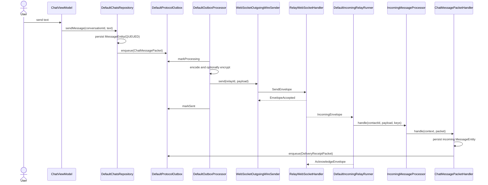
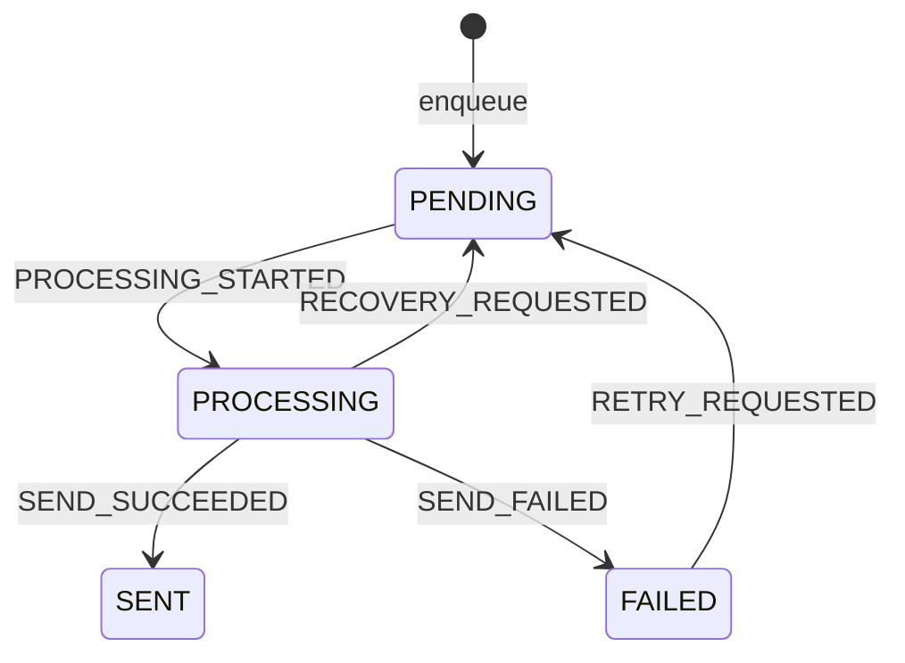
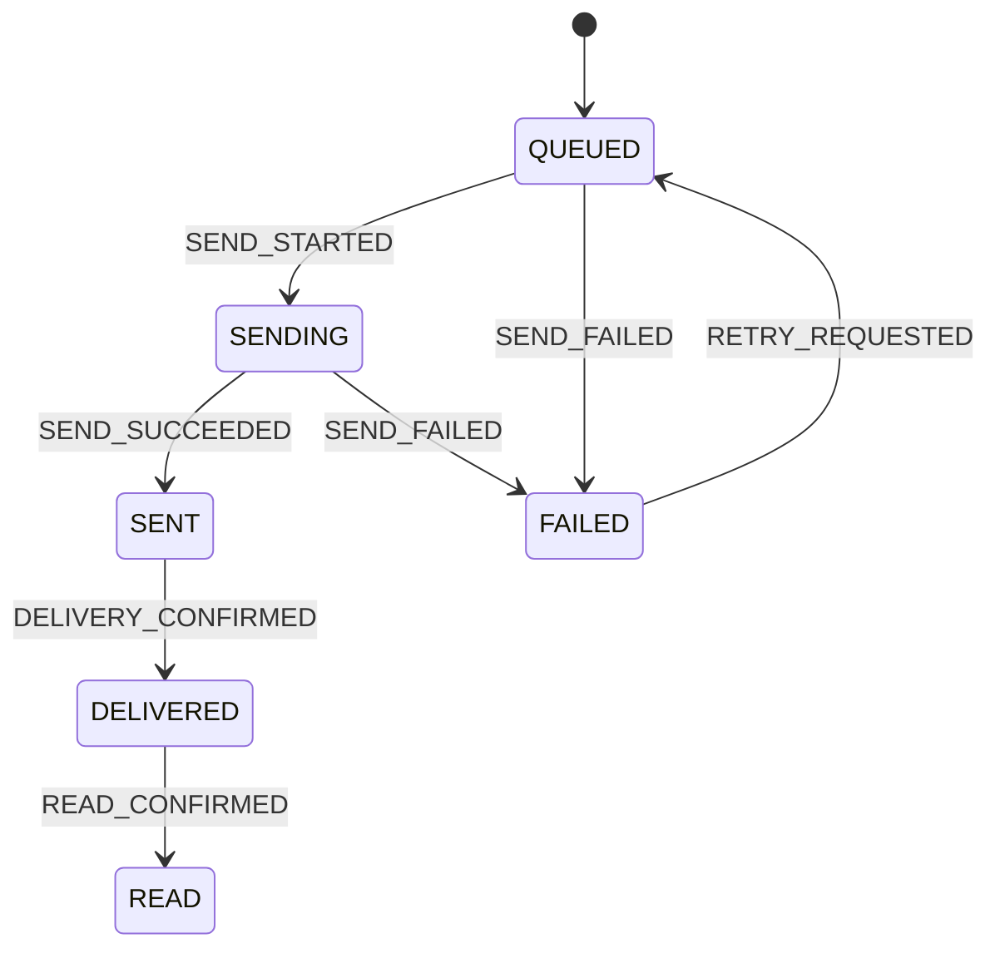

# Messaging and Delivery Flow

This is the implementation guide for SecureChat messaging. It follows the current production
classes from UI intent to relay storage and back to the receiving database, then explains how to
extend the design safely.

For module ownership first, read [Messaging Boundary](../architecture/messaging-boundary.md).

## Mental model

A message crosses four different representations:

| Representation | Example type | Owner |
|---|---|---|
| Domain/chat state | `MessageEntity`, `MessageDeliveryStatus` | `:feature:chats` and `:data:database` |
| Protocol packet | `ChatMessagePacket`, `DeliveryReceiptPacket` | `:core:protocol` |
| Encoded transport payload | `EncryptedTransportPayload` encoded by `TransportPayloadCodec` | `:core:crypto` |
| Relay frame | `RelayClientMessage.SendEnvelope` containing a `RelayEnvelope` | `:feature:transport` |

Do not collapse these layers. A protocol packet describes meaning; a transport payload describes
protection; a relay envelope describes routing.

## Complete direct-message path



There are two acknowledgements:

- `EnvelopeAccepted` means the relay accepted the outgoing envelope. The sender becomes `SENT`.
- `DeliveryReceiptPacket` means the recipient decoded and stored the message. The sender becomes
  `DELIVERED`.

`AcknowledgeEnvelope` is different again: it lets the relay remove its pending copy after the
recipient finishes local processing.

## Runtime startup and connection lifecycle

`SecureChatApplication` waits until `IdentityRepository.observeIdentity()` returns an identity and
`LocalPhoneNameStorage.observePhoneNumber()` returns a non-blank phone number. It then calls
`startRuntimeServices()`:

1. `IncomingRelayRunner.start()` starts collecting `WebSocketTransportClient.incomingEnvelopes`.
2. `RelayConnectionManager.start()` starts the relay connection loop.
3. `SecureChatApplication` observes `RelayConnectionManager.connectionState`.
4. Each time the state becomes `TransportConnectionState.Connected`, it calls
   `OutboxRunner.start()`.

`DefaultRelayConnectionManager` resolves the local address through `LocalRelayIdProvider`, connects
with `WebSocketTransportClient.connect()`, and retries after failures. The backoff starts at one
second, doubles, and is capped at 30 seconds. A connection attempt times out after 15 seconds.

`DefaultOutboxRunner.start()` is intentionally safe to call after every reconnect. It:

- creates the `ProtocolOutbox.observePending()` collector only when one is not already active;
- calls `ProtocolOutbox.requeueInterrupted()` for rows left in `PROCESSING`;
- calls `ProtocolOutbox.retryFailed()` for failed attempts;
- drains all currently available items.

The `processingMutex` prevents the Room observer and reconnect recovery from draining concurrently.
Batches contain at most 20 items.

## Creating outgoing work

### Direct message

`ChatViewModel` calls the `SendMessage` use case, which delegates to
`DefaultChatsRepository.sendMessage()`.

The repository:

1. trims and validates the text;
2. loads a direct `ConversationEntity` and its contact;
3. creates one `ChatMessagePacket`;
4. stores the visible `MessageEntity` with `QUEUED`;
5. updates the conversation timestamp;
6. calls `ProtocolOutbox.enqueue(contactId, packet)`.

The visible message is stored before the outbox row. If enqueue fails,
`MessageDeliveryStateCoordinator` applies `SEND_FAILED`.

### Group creation

`CreateGroupConversation` calls `DefaultChatsRepository.createGroupConversation()`, which delegates
to `GroupInvitationCoordinator.createGroup()`. The coordinator creates a local pending group and a
`GroupInvitationEntity` for every selected contact.

For every selected contact, the coordinator:

1. creates a random invitation challenge with `GroupInvitationManager`;
2. signs a `GroupInvitePacket` containing the owner's public identity but no group key;
3. sends it to the contact's phone-derived relay ID;
4. lets `GroupInvitePacketHandler` verify it and persist a recipient-side group in
   `AWAITING_ACCEPTANCE`;
5. waits until `AcceptGroupInvitation` explicitly creates the signed `GroupJoinRequestPacket`;
6. verifies that join on the creator and stores the discovered identity as mutual but unverified;
7. changes the creator-side row from `INVITE_SENT` to `IDENTITY_READY`.

Known identities still receive an invitation because knowing a key is not consent to join a
group. Only when every selected contact has accepted does `GroupInvitationCoordinator` call
`GroupSecurityManager.createOwnedGroup()`.

`GroupSecurityManager`:

1. generates a random epoch-1 key through `GroupCrypto.generateGroupKey()`;
2. saves it through `GroupKeyStorage`;
3. snapshots remote member keys through `GroupSecurityDao`;
4. wraps the same key separately for every recipient with `GroupCrypto.wrapGroupKey()`;
5. signs each canonical welcome from `GroupProtocolPayloadEncoder.encodeWelcome()`;
6. returns one deterministic `GroupCreatedPacket` per contact.

Only `wrappedGroupKey` enters the persistent outbox. `DefaultOutboxProcessor` requires
`SEALED_BOX` transport for `GroupCreatedPacket` and fails instead of falling back to plaintext.
Invitation packets may use plaintext outer transport because their signatures protect integrity
and they never contain a group key or message content.

Receiving the welcome is not assumed to mean the member is ready. `GroupCreatedPacketHandler`
verifies and persists the key first, then signs and queues `GroupReadyAcknowledgementPacket`. Its
SHA-256 key-confirmation field is derived from the group ID, epoch, and recovered 256-bit key.
`GroupReadyAcknowledgementPacketHandler` changes the creator-side member row from `WELCOME_SENT`
to `ACTIVE` only after the creator recomputes the same confirmation. Only when every row is
`ACTIVE` may queued group content fan out.

### Group message

`SendGroupMessage` calls `DefaultChatsRepository.sendGroupMessage()`, which delegates to
`GroupMessageSender.queueOrSend()`.

If the creator is still waiting for accepts or ready acknowledgements, `GroupMessageSender` stores
only the visible `MessageEntity(QUEUED)`. The input remains disabled for an invitee until
`GroupCreatedPacketHandler` has installed the welcome. When the group becomes fully active,
`GroupMessageSender.flushQueued()` processes the creator's stored rows in creation order.

For each active message, `GroupMessageSender`:

1. validates that the conversation is a group;
2. creates one shared `messageId`;
3. calls `GroupSecurityManager.encryptMessage()` once;
4. binds version, group ID, epoch, message ID, and timestamp as AEAD associated data;
5. encrypts with XChaCha20-Poly1305 and signs the header, nonce, and ciphertext with Ed25519;
6. creates a distinct `GroupChatMessagePacket.packetId` for every participant while reusing the
   authenticated ciphertext;
7. stores one visible `MessageEntity` and one `MessageRecipientStateEntity` per participant;
8. enqueues each packet for its participant.

Per-recipient rows are the source of truth for group delivery. The visible message status is
recomputed by `MessageDeliveryStateMachine.aggregate()`.

### Identity exchange and receipts

The same outbox also carries control packets:

- `DefaultIdentityExchangeStarter` enqueues `IdentityPacket`.
- `IdentityPacketHandler` enqueues `IdentityAcknowledgementPacket`.
- `ChatMessagePacketHandler` and `GroupChatMessagePacketHandler` enqueue
  `DeliveryReceiptPacket`.
- `DefaultChatsRepository.markConversationRead()` enqueues `ReadReceiptPacket`.

No handler sends directly to the WebSocket. Persisting through `ProtocolOutbox` gives every packet
the same retry and recovery behavior.

## Persistent protocol outbox

`ProtocolOutbox` is the transport-independent contract in `:core:protocol`.
`DefaultProtocolOutbox` is the Room-backed implementation in `:data:database`, using
`ProtocolOutboxDao` and `ProtocolOutboxEntity`.

`DefaultProtocolOutbox.enqueue()`:

- validates the contact and packet IDs;
- returns the existing row when `packetId` is already present;
- encodes the `SecureChatPacket` with `PacketCodec`;
- persists a new row as `PENDING`.

The idempotency key is `packetId`, not `messageId`.

### Outbox state machine



`OutboxStateMachine` defines valid transitions and `DefaultProtocolOutbox` validates them before
DAO updates. `retryFailed()` and `requeueInterrupted()` are bulk recovery operations used on
connection availability.

## Preparing and sending a queued packet

`DefaultOutboxProcessor.processPending()` loads up to the requested limit and continues processing
other rows if one item fails. For each `ProtocolOutboxItem`, `processItem()` performs:

1. `ProtocolOutbox.markProcessing(item.id)`;
2. `OutboxDeliveryStateListener.onProcessing(item.packetId)`;
3. `GetContact(item.contactId)`;
4. packet protection through `createTransportPayload()`;
5. encoding through `TransportPayloadCodec.encode()`;
6. `OutboxDeliveryStateListener.onPrepared()` to persist the exact payload and mode;
7. recipient resolution through `ContactRelayIdResolver`;
8. `OutgoingWireSender.send(recipientRelayId, encodedTransportPayload)`;
9. `ProtocolOutbox.markSent(item.id)`;
10. `OutboxDeliveryStateListener.onSent(item.packetId)`.

Any failure before `markSent()` changes the outbox row to `FAILED` and calls
`OutboxDeliveryStateListener.onFailed()`.

The production listener is `ChatOutboxDeliveryStateListener`. It delegates to
`MessageDeliveryStateCoordinator`; control packets without visible chat state are valid and simply
produce no chat-row transition.

## Plaintext and sealed-box selection

`DefaultOutboxProcessor.createTransportPayload()` selects the current transport mode:

| Condition | Mode |
|---|---|
| Packet is `GroupCreatedPacket`, but identity is not mutual | Fail; never plaintext |
| Contact has no `SecureChatIdentity` | `PLAINTEXT` |
| Contact encryption key is empty | `PLAINTEXT` |
| `KeyExchangeStatus` is not `MUTUAL` | `PLAINTEXT` |
| Contact has a non-empty key and `KeyExchangeStatus.MUTUAL` | `SEALED_BOX` |

For `SEALED_BOX`, the processor calls
`TransportMessageCipher.encryptForRecipient(plaintext, recipientPublicKey)`. For plaintext, it
constructs `EncryptedTransportPayload` directly. Both modes are encoded by
`TransportPayloadCodec`; therefore “plaintext” means the protocol bytes are not end-to-end
encrypted, not that raw protocol JSON is placed directly in a WebSocket frame.

`GroupChatMessagePacket` may also use plaintext outer transport because its content is already
authenticated ciphertext under the shared group epoch key. Incoming and outgoing group messages
are persisted with transport mode `GROUP_E2EE`, so the UI reports their actual content security
instead of the optional outer wrapper.

`DefaultChatsRepository.plannedTransportMode()` mirrors the same contact conditions so the UI can
store the intended mode immediately. `DefaultOutboxProcessor` remains authoritative when the packet
is actually sent.

## Relay address resolution

The wire uses relay IDs, while chat and contacts use contact IDs.

### Outgoing

`DefaultContactRelayIdResolver.resolve(contactId)`:

1. returns an existing `ContactRelayIdDao` mapping;
2. otherwise loads the contact with `GetContact`;
3. selects the preferred phone number or first available number;
4. derives the relay ID with `RelayIdGenerator`;
5. persists `ContactRelayIdEntity`.

The production generator is `Sha256RelayIdGenerator`.

### Incoming

`DefaultContactByRelayIdResolver.resolveContactId(relayId)`:

1. checks `ContactRelayIdDao`;
2. derives relay IDs for known contact phone numbers until one matches;
3. persists the match if found;
4. otherwise creates an unlinked placeholder `ContactEntity` and stores the relay mapping.

This placeholder lets the incoming pipeline continue for a previously unknown sender. A later chat
packet may call `ContactDao.usePhoneNumberAsDisplayNameWhenMissing()` using
`ChatMessagePacket.senderPhoneNumber`.

## WebSocket send and relay acceptance

`WebSocketOutgoingWireSender` implements the protocol port `OutgoingWireSender`. It gets the sender
ID from `LocalRelayIdProvider`, creates a `RelayEnvelope`, and calls
`WebSocketTransportClient.sendEnvelopeAndAwaitAcceptance()`.

`DefaultWebSocketTransportClient`:

- requires `TransportConnectionState.Connected`;
- stores a `CompletableDeferred` by `envelopeId`;
- sends `RelayClientMessage.SendEnvelope`;
- waits for `RelayServerMessage.EnvelopeAccepted`;
- fails on timeout, connection closure, or send failure.

A `RelayServerMessage.Error` is logged but does not automatically close the socket. The pending
acceptance eventually times out, causing the outbox item to fail.

## Relay-side routing

`RelayWebSocketHandler` requires `RelayClientMessage.Register` before other operations.
`InMemoryRelayConnectionRegistry` maps a relay ID to its active `RelayClientConnection`.

For `RelayClientMessage.SendEnvelope`, the handler:

1. rejects a sender ID that differs from the registered relay ID;
2. calls `DefaultRelayEnvelopeRouter.accept()`;
3. sends `RelayServerMessage.EnvelopeAccepted` after storage succeeds;
4. calls `deliverPending(recipientId)` for immediate delivery when possible.

`DefaultRelayEnvelopeRouter.accept()` writes to `PendingEnvelopeStore`. The current implementation,
`InMemoryPendingEnvelopeStore`, uses `putIfAbsent(envelopeId, envelope)` so submitting the same
envelope again does not duplicate it.

When a recipient registers, `RelayWebSocketHandler.handleRegistration()` also calls
`deliverPending()`. Envelopes remain in the store until the recipient sends
`RelayClientMessage.AcknowledgeEnvelope`.

!!! warning "Current durability limit"
    `InMemoryPendingEnvelopeStore` survives client disconnects but not a relay-process restart.
    Client outbox rows are durable in Room; accepted relay envelopes are not yet durable.

## Incoming decoding and dispatch

`DefaultWebSocketTransportClient` emits `RelayServerMessage.IncomingEnvelope.envelope` through
`incomingEnvelopes`.

`DefaultIncomingRelayRunner`:

1. maps `RelayEnvelope.senderId` to a contact with `ContactByRelayIdResolver`;
2. obtains keys from `LocalEncryptionKeyPairProvider`;
3. calls `IncomingMessageHandler.handle()` with the contact, payload, and key pair;
4. calls `WebSocketTransportClient.acknowledgeIncomingEnvelope()` only after handling returns.

`IncomingMessageProcessor` is the `IncomingMessageHandler` implementation. It calls
`IncomingTransportMessageDecoder.decode()` and handles four outcomes:

| Decoder result | Behavior |
|---|---|
| `DecodedTransportMessage.Readable` | Decode the protocol packet and dispatch it |
| `DecodedTransportMessage.InvalidPacket` | Store an unreadable direct message with `INVALID_PACKET` |
| `DecodedTransportMessage.InvalidPlaintext` | Store with `INVALID_PLAINTEXT_PACKET` |
| `DecodedTransportMessage.DecryptionFailed` | Store with `TRANSPORT_DECRYPTION_FAILED` |

For readable data, `KotlinxPacketCodec` decodes a `SecureChatPacket`. The processor creates
`IncomingPacketContext`, including contact ID, resolved conversation ID, original transport payload,
transport mode, and receive time.

`DefaultProtocolPacketHandler` selects the first registered `TypedProtocolPacketHandler` whose
`canHandle()` returns true. If there is no handler, or the selected handler fails, the relay
envelope is normally not acknowledged and may be delivered again. A direct `ChatMessagePacket`
handler failure is represented as an unreadable stored message instead.

## Registered packet handlers

`protocolModule` builds `DefaultProtocolPacketHandler` from all Koin bindings of
`TypedProtocolPacketHandler`. `chatsModule` and `contactsModule` contribute the handlers:

| `packetType` | Packet class | Handler | Effect |
|---|---|---|---|
| `chat_message` | `ChatMessagePacket` | `ChatMessagePacketHandler` | Upsert direct message; queue delivery receipt |
| `group_invite` | `GroupInvitePacket` | `GroupInvitePacketHandler` | Verify owner identity proof and persist an invitation awaiting user consent |
| `group_join_request` | `GroupJoinRequestPacket` | `GroupJoinRequestPacketHandler` | Verify invited contact and challenge, store identity, continue activation |
| `group_invite_declined` | `GroupInviteDeclinedPacket` | `GroupInviteDeclinedPacketHandler` | Verify the invited contact's signed decline |
| `group_created` | `GroupCreatedPacket` | `GroupCreatedPacketHandler` | Verify owner, unwrap/persist key, create epoch snapshot, queue ready acknowledgement |
| `group_ready_acknowledgement` | `GroupReadyAcknowledgementPacket` | `GroupReadyAcknowledgementPacketHandler` | Verify key installation and activate the creator-side member row |
| `group_chat_message` | `GroupChatMessagePacket` | `GroupChatMessagePacketHandler` | Verify member/signature, decrypt, persist, queue receipt |
| `delivery_receipt` | `DeliveryReceiptPacket` | `DeliveryReceiptPacketHandler` | Apply `DELIVERY_CONFIRMED` |
| `read_receipt` | `ReadReceiptPacket` | `ReadReceiptPacketHandler` | Apply `READ_CONFIRMED` |
| `identity` | `IdentityPacket` | `IdentityPacketHandler` | Store remote identity and queue signed acknowledgement |
| `identity_acknowledgement` | `IdentityAcknowledgementPacket` | `IdentityAcknowledgementPacketHandler` | Verify acknowledgement against stored remote and current local keys |

## Message idempotency and receipts

`ChatMessagePacketHandler` uses `ChatMessagePacket.messageId` as the incoming Room primary key.
Repeated delivery therefore updates the same message instead of creating another visible row. It
queues a delivery receipt only after persistence succeeds.

Direct-message receipt IDs are deterministic:

```text
delivery-receipt-<messageId>
read-receipt-<messageId>
```

For group messages, the delivery receipt includes the receiver contact in its packet ID:

```text
delivery-receipt-<messageId>-<contactId>
```

`DefaultChatsRepository.markConversationRead()` finds incoming messages awaiting a receipt, enqueues
`ReadReceiptPacket`, and only then marks the local row as having a read receipt sent.

## User-visible delivery state

`MessageDeliveryStateMachine` defines the user-visible state:



Delivery and read confirmations may also arrive from an earlier local state. The state machine
accepts them without regressing later states, making duplicate and reordered receipts safe.

| Status | Exact meaning |
|---|---|
| `NOT_APPLICABLE` | Incoming message; outgoing delivery progress does not apply |
| `QUEUED` | Visible state and protocol packet are intended for local queueing |
| `SENDING` | The outbox is preparing or transmitting the packet |
| `SENT` | The relay accepted the envelope |
| `DELIVERED` | The recipient persisted the message and returned a delivery receipt |
| `READ` | The recipient queued a read receipt after marking the conversation read |
| `FAILED` | The local preparation or wire attempt failed |

For groups, `MessageDeliveryStateCoordinator` updates the matching
`MessageRecipientStateEntity` by `packetId`, then calls `MessageDeliveryStateMachine.aggregate()`.
`SENT`, `DELIVERED`, and `READ` require every recipient to have reached that level or later.

## Manual retry

`RetryMessage` calls `DefaultChatsRepository.retryMessage(messageId)`. The repository requires an
outgoing `FAILED` message, finds linked outbox rows by packet ID, calls
`ProtocolOutbox.retry(itemId)`, and applies `RETRY_REQUESTED`.

For a group, only failed recipient rows are retried. A pending-flow emission wakes
`DefaultOutboxRunner`; a later reconnect also retries failed rows automatically.

## Typing indicators

Typing state is deliberately outside the persistent protocol outbox. It is ephemeral.

`ChatViewModel` and `GroupConversationViewModel` call `SetTypingIndicator` and observe
`ObserveTypingIndicator`. Both use the `TypingIndicatorGateway` domain port from `:feature:chats`.

`RelayTypingIndicatorGateway` in `:feature:messaging`:

- resolves a contact ID through `ContactRelayIdResolver`;
- sends with `WebSocketTransportClient.sendTypingState()`;
- filters `incomingTypingEvents` by the resolved sender relay ID;
- applies `distinctUntilChanged()`.

The transport serializes `RelayClientMessage.TypingState`. `RelayWebSocketHandler` forwards it only
to a currently connected recipient as `RelayServerMessage.TypingState`; it is not persisted in
`PendingEnvelopeStore`.

## Failure and duplicate behavior

| Failure point | Persisted result | Relay acknowledgement |
|---|---|---|
| Outbox packet preparation or send fails | Outbox `FAILED`; visible outgoing state `FAILED` when linked | Not applicable |
| Relay accepted, but client missed `EnvelopeAccepted` | Local attempt times out and may retry; relay deduplicates the same `envelopeId` | Not applicable |
| Incoming payload is unreadable but stored as failure | Failed incoming `MessageEntity` exists | Sent after handler returns |
| Typed packet handler fails | No successful application result | Not sent |
| Incoming envelope acknowledgement send fails | Application work may already be stored | Relay retains and redelivers; handlers must remain idempotent |
| Relay process restarts | Client outbox survives; in-memory relay pending data does not | Pending data is lost |

Every new incoming handler must assume at-least-once delivery.

## How to add a protocol packet

Use this checklist:

1. Add a serializable packet under `:core:protocol/.../packet` implementing `SecureChatPacket`.
2. Give it a unique `@SerialName`; `createProtocolJson()` uses `packetType` as the discriminator.
3. Add encode/decode coverage to `KotlinxPacketCodecTest`.
4. Put the behavior in the feature that owns the meaning.
5. Implement `TypedProtocolPacketHandler` there.
6. Bind the handler as `TypedProtocolPacketHandler` in that feature’s Koin module.
7. Create the packet from a repository, use case adapter, or existing packet handler and enqueue it
   through `ProtocolOutbox`.
8. Make persistence idempotent by a stable business identifier; do not rely only on relay
   deduplication.
9. Decide whether the packet follows normal encryption selection. If it must never use plaintext,
   add it to the explicit requirement in `DefaultOutboxProcessor` and test both mutual and
   non-mutual contacts.
10. Document its delivery semantics here and in [Protocol](../api/protocol.md).

Do not add a `when` branch to `DefaultProtocolPacketHandler`; registration is polymorphic through
`TypedProtocolPacketHandler`.

## How to add or replace a wire transport

The stable outgoing port is `OutgoingWireSender`. The current adapter is
`WebSocketOutgoingWireSender`.

For another wire:

1. Implement `OutgoingWireSender.send(recipientAddress, encodedTransportPayload)`.
2. Define what successful return means. To preserve current delivery state, success must mean that
   the transport has durably accepted responsibility, equivalent to `EnvelopeAccepted`.
3. Bind the implementation in DI instead of `WebSocketOutgoingWireSender`.
4. If incoming data is also different, expose it behind an incoming transport port and adapt
   `DefaultIncomingRelayRunner`; do not put transport-specific frames in `IncomingMessageProcessor`.
5. Keep `DefaultOutboxProcessor`, `ProtocolOutbox`, packet handlers, and delivery state independent
   of the wire format.

## How to change relay addressing

Address derivation is isolated by:

- `RelayIdGenerator`;
- `LocalRelayIdProvider`;
- `ContactRelayIdResolver`;
- `ContactByRelayIdResolver`.

Change or replace these contracts and adapters together. Plan a migration for persisted
`ContactRelayIdEntity` rows. Do not derive relay IDs inside chat repositories or ViewModels.

## How to add a delivery state

Delivery state exists at two levels:

- `OutboxStatus` describes the send attempt.
- `MessageDeliveryStatus` describes user-visible progress.

For an outbox lifecycle change, update `OutboxEvent`, `OutboxStateMachine`, persistence operations,
and `OutboxStateMachineTest`.

For a visible state, update `MessageDeliveryEvent`, `MessageDeliveryStateMachine`,
`MessageDeliveryStateCoordinator`, group aggregation, database serialization, UI mapping, and
`MessageDeliveryStateMachineTest`. Define how late and duplicate events behave before changing the
code.

## Tests to protect when extending messaging

The repository currently has focused tests for:

- packet encoding in `KotlinxPacketCodecTest`, `GroupInvitationPacketCodecTest`,
  `GroupCreatedPacketCodecTest`, and `GroupChatMessagePacketCodecTest`;
- outbox transitions in `OutboxStateMachineTest`;
- visible delivery transitions and aggregation in `MessageDeliveryStateMachineTest`;
- transport payload codec in `DefaultTransportPayloadCodecTest`;
- device crypto in `SodiumTransportMessageCipherTest` and `SodiumGroupCryptoTest`;
- canonical group authentication data in `GroupProtocolPayloadEncoderTest`;
- invitation signing and verification in `GroupInvitationManagerTest`;
- group security orchestration in `GroupSecurityManagerTest`;
- protected epoch-key persistence in `AndroidGroupKeyStorageTest`.

New orchestration behavior should add tests around `DefaultOutboxProcessor`,
`DefaultOutboxRunner`, `DefaultIncomingRelayRunner`, typed handlers, and relay acknowledgement
timing. Those are the boundaries where a refactor can otherwise change reliability semantics while
still compiling.

## Class index

| Area | Classes and interfaces |
|---|---|
| Startup | `SecureChatApplication`, `RelayConnectionManager`, `DefaultRelayConnectionManager`, `TransportConnectionState` |
| Outgoing orchestration | `OutboxRunner`, `DefaultOutboxRunner`, `OutboxProcessor`, `DefaultOutboxProcessor` |
| Persistent queue | `ProtocolOutbox`, `DefaultProtocolOutbox`, `ProtocolOutboxDao`, `ProtocolOutboxItem`, `OutboxStateMachine` |
| Delivery state | `ChatOutboxDeliveryStateListener`, `MessageDeliveryStateCoordinator`, `MessageDeliveryStateMachine` |
| Address mapping | `RelayIdGenerator`, `Sha256RelayIdGenerator`, `ContactRelayIdResolver`, `DefaultContactRelayIdResolver`, `ContactByRelayIdResolver`, `DefaultContactByRelayIdResolver` |
| Wire transport | `OutgoingWireSender`, `WebSocketOutgoingWireSender`, `WebSocketTransportClient`, `DefaultWebSocketTransportClient` |
| Incoming orchestration | `IncomingRelayRunner`, `DefaultIncomingRelayRunner`, `IncomingMessageHandler`, `IncomingMessageProcessor` |
| Packet dispatch | `ProtocolPacketHandler`, `DefaultProtocolPacketHandler`, `TypedProtocolPacketHandler`, `IncomingPacketContext` |
| Relay server | `RelayWebSocketHandler`, `DefaultRelayEnvelopeRouter`, `InMemoryRelayConnectionRegistry`, `InMemoryPendingEnvelopeStore` |
| Typing | `TypingIndicatorGateway`, `RelayTypingIndicatorGateway`, `RelayTypingEvent` |
