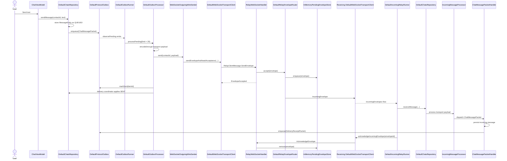
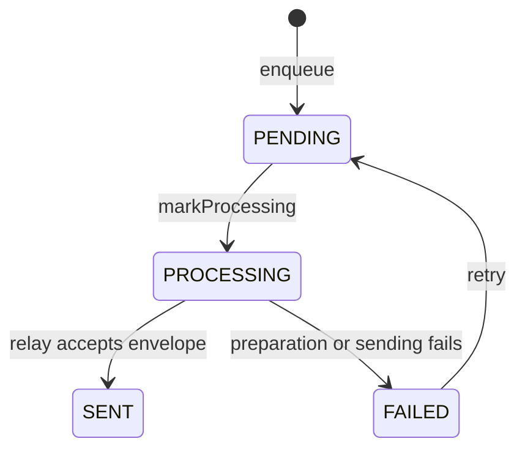

# Message Sending and Transport Flow

This page documents the current SecureChat message-delivery implementation using the actual production classes in the repository.

It covers:

- creation of an outgoing chat message
- persistent outbox storage
- payload preparation and encryption
- WebSocket relay delivery
- relay acceptance and offline storage
- incoming packet decoding and persistence
- delivery and read receipts
- reconnect and retry behavior

## End-to-end overview



## Runtime startup

Transport services are started from `SecureChatApplication.startRuntimeServices()`.

The startup sequence is:

1. `IncomingRelayRunner.start()` begins collecting incoming relay envelopes.
2. `RelayConnectionManager.start()` starts the reconnecting WebSocket loop.
3. `SecureChatApplication` observes `RelayConnectionManager.connectionState`.
4. When the state becomes `TransportConnectionState.Connected`, it calls `OutboxRunner.start()`.

Important classes:

| Responsibility | Class |
|---|---|
| Android process startup | `SecureChatApplication` |
| Connection lifecycle | `DefaultRelayConnectionManager` |
| WebSocket implementation | `DefaultWebSocketTransportClient` |
| Incoming-envelope collector | `DefaultIncomingRelayRunner` |
| Persistent outbox observer | `DefaultOutboxRunner` |

## 1. Creating an outgoing message

The outgoing flow begins in:

```kotlin
DefaultChatsRepository.sendMessage(
    conversationId: String,
    text: String,
)
```

`DefaultChatsRepository` performs the following steps:

1. Trims the message and ignores blank input.
2. Loads the direct conversation and recipient.
3. Creates a `ChatMessagePacket` containing:
   - `packetId`
   - `messageId`
   - `sentAtEpochMilliseconds`
   - message text
4. Stores a visible `MessageEntity` with `MessageDeliveryStatus.QUEUED`.
5. Updates the conversation timestamp.
6. Enqueues the packet through `ProtocolOutbox.enqueue()`.

The visible message is stored first so an immediately running outbox processor can always find its delivery state. If enqueueing fails, the delivery state machine moves the visible message to `FAILED`.

`ProtocolOutbox.enqueue()` is idempotent by `packetId`, so repeating the same enqueue operation does not create a duplicate outbox entry.

## 2. Persistent protocol outbox

The outbox abstraction is:

```kotlin
interface ProtocolOutbox
```

Its Room-backed implementation is:

```kotlin
DefaultProtocolOutbox
```

The persistent entity is `ProtocolOutboxEntity`, accessed through `ProtocolOutboxDao`.

### Outbox states

`OutboxStatus` defines four states:

```text
PENDING
PROCESSING
SENT
FAILED
```

The normal state transition is:



`OutboxStateMachine` is the single definition of valid outbox transitions. Database methods persist those transitions but do not define additional lifecycle rules.

`DefaultProtocolOutbox.enqueue()`:

- checks for an existing row by `packetId`
- encodes the `SecureChatPacket` with `PacketCodec`
- stores the encoded bytes with status `PENDING`
- returns the existing item when the same packet ID was already queued

This idempotency is used by chat messages, delivery receipts, read receipts, and identity-exchange packets.

## 3. Observing and draining the outbox

`DefaultOutboxRunner` observes:

```kotlin
protocolOutbox.observePending()
```

When Room emits at least one pending item, the runner calls:

```kotlin
outboxProcessor.processPending(limit = 20)
```

A `Mutex` named `processingMutex` ensures that only one outbox-draining loop runs at a time.

The runner processes batches until one of these conditions is reached:

- no pending items remain
- a batch contains fewer than 20 items
- processing returns a failure

`DefaultOutboxRunner` does not prepare encryption or talk to the WebSocket directly. That work belongs to `DefaultOutboxProcessor`.

## 4. Preparing and sending one outbox item

`DefaultOutboxProcessor.processItem()` owns one complete send attempt.

Its sequence is:

1. `ProtocolOutbox.markProcessing(item.id)`
2. `OutboxDeliveryStateListener.onProcessing(packetId)`
3. load the recipient through `GetContact`
4. create an `EncryptedTransportPayload`
5. encode it with `TransportPayloadCodec`
6. store the exact prepared payload
7. send it through `OutgoingWireSender`
8. mark the outbox row as `SENT`
9. update the visible message to `SENT`

If any step inside the send block fails:

1. `ProtocolOutbox.markFailed()` stores the error
2. `OutboxDeliveryStateListener.onFailed()` updates the visible message to `FAILED`

### Visible chat status synchronization

The implementation of `OutboxDeliveryStateListener` is:

```kotlin
ChatOutboxDeliveryStateListener
```

It translates protocol-outbox callbacks into `MessageDeliveryEvent` values. `MessageDeliveryStateCoordinator` then:

- loads the current direct-message or recipient state
- asks `MessageDeliveryStateMachine` for the next state
- persists the transition
- derives the group message status from all recipient states

| Outbox callback | Visible message status |
|---|---|
| `onProcessing()` | `SENDING` |
| `onSent()` | `SENT` |
| `onFailed()` | `FAILED` |

Not every protocol packet has a visible chat row. Identity packets and receipt packets can therefore update zero message rows without being treated as errors.

Late and duplicate events are intentional no-ops. For example, an older delivery receipt cannot move a message from `READ` back to `DELIVERED`.

## 5. Plaintext versus encrypted transport payloads

`DefaultOutboxProcessor.createTransportPayload()` decides whether the protocol packet is encrypted.

Encryption is enabled only when the contact has:

- a `secureChatIdentity`
- a non-empty encryption public key
- `KeyExchangeStatus.MUTUAL`

When these conditions are not met, the processor creates:

```kotlin
EncryptedTransportPayload(
    version = 1,
    mode = TransportEncryptionMode.PLAINTEXT,
    payload = encodedPacket,
)
```

When the key exchange is mutual, it uses:

```kotlin
TransportMessageCipher.encryptForRecipient(...)
```

The concrete crypto implementation is `SodiumTransportMessageCipher`.

The result is serialized by `TransportPayloadCodec` before it enters the relay transport layer.

## 6. Creating the relay envelope

`WebSocketOutgoingWireSender` implements `OutgoingWireSender`.

It resolves:

- the local sender relay ID through `LocalRelayIdProvider`
- the recipient relay ID through `ContactRelayIdResolver`

It then creates a `RelayEnvelope` containing:

- `envelopeId`
- `senderId`
- `recipientId`
- opaque encoded transport payload
- creation timestamp

The sender calls:

```kotlin
DefaultWebSocketTransportClient.sendEnvelopeAndAwaitAcceptance(...)
```

This is an important boundary:

- `SENT` means the relay accepted and stored the envelope.
- It does **not** yet mean the recipient stored the chat message.

## 7. WebSocket acceptance

`DefaultWebSocketTransportClient` serializes the envelope into:

```kotlin
RelayClientMessage.SendEnvelope
```

It registers a pending `CompletableDeferred` for the envelope ID and waits for one of these outcomes:

- `RelayServerMessage.EnvelopeAccepted`
- relay error
- WebSocket closure
- acknowledgement timeout

`WebSocketOutgoingWireSender` uses `RelayTransportConfig.acknowledgementTimeoutMilliseconds` as the timeout.

When `EnvelopeAccepted` arrives, the deferred completes and the local sender can mark the outbox row and visible message as `SENT`.

## 8. Relay-side storage and routing

The relay entry point for WebSocket frames is:

```kotlin
RelayWebSocketHandler
```

Clients must first send `RelayClientMessage.Register`. The relay stores active sessions in:

```kotlin
InMemoryRelayConnectionRegistry
```

### Accepting an envelope

For `RelayClientMessage.SendEnvelope`, `RelayWebSocketHandler`:

1. verifies that the envelope sender matches the registered relay ID
2. calls `DefaultRelayEnvelopeRouter.accept()`
3. sends `RelayServerMessage.EnvelopeAccepted` to the sender
4. attempts immediate delivery to the recipient

`DefaultRelayEnvelopeRouter.accept()` stores the envelope in:

```kotlin
InMemoryPendingEnvelopeStore
```

The store uses `putIfAbsent(envelopeId, envelope)`, making repeated submission of the same relay envelope idempotent.

### Offline recipient behavior

If the recipient is not connected, `deliverPending()` returns and the envelope remains in `InMemoryPendingEnvelopeStore`.

When the recipient later registers, `RelayWebSocketHandler.handleRegistration()` calls:

```kotlin
envelopeRouter.deliverPending(recipientId)
```

The current relay store is in memory. Pending envelopes therefore survive a client disconnect but do not survive a relay-process restart.

## 9. Receiving an envelope

`DefaultWebSocketTransportClient` exposes accepted incoming envelopes through:

```kotlin
incomingEnvelopes: Flow<RelayEnvelope>
```

`DefaultIncomingRelayRunner` collects that flow.

For each envelope it:

1. resolves `senderRelayId` to a local contact using `ContactByRelayIdResolver`
2. obtains the local encryption key pair through `LocalEncryptionKeyPairProvider`
3. calls `DefaultChatsRepository.receiveMessage()`
4. acknowledges the relay envelope only after local processing succeeds

The acknowledgement call is:

```kotlin
webSocketTransportClient.acknowledgeIncomingEnvelope(envelopeId)
```

That sends `RelayClientMessage.AcknowledgeEnvelope` to the relay. `RelayWebSocketHandler` then removes the envelope from `PendingEnvelopeStore`.

If processing fails, no envelope acknowledgement is sent, so the relay can deliver the envelope again later.

## 10. Decoding and dispatching incoming protocol packets

`DefaultChatsRepository.receiveMessage()` delegates the complete incoming pipeline to:

```kotlin
IncomingMessageProcessor
```

The processor passes the encoded payload to:

```kotlin
IncomingTransportMessageDecoder
```

The concrete implementation is:

```kotlin
DefaultIncomingTransportMessageDecoder
```

The decoder returns one of these result types:

- `DecodedTransportMessage.Readable`
- `DecodedTransportMessage.InvalidPacket`
- `DecodedTransportMessage.InvalidPlaintext`
- `DecodedTransportMessage.DecryptionFailed`

Readable packets are decoded with `PacketCodec` and dispatched through `ProtocolPacketHandler` using an `IncomingPacketContext`.

The receive pipeline is deliberately separate from the outgoing state machines:

```text
decode transport -> decode packet -> resolve conversation -> dispatch handler -> persist
```

Transport failures become stored unreadable messages. Handler failures prevent relay acknowledgement unless the direct chat failure can be represented locally.

The registered typed handlers include:

| Packet | Handler |
|---|---|
| `ChatMessagePacket` | `ChatMessagePacketHandler` |
| `DeliveryReceiptPacket` | `DeliveryReceiptPacketHandler` |
| `ReadReceiptPacket` | `ReadReceiptPacketHandler` |
| identity packet types | identity-specific handlers |

Malformed or undecryptable payloads are stored as failed incoming messages with the appropriate `MessageContentStatus`, allowing the UI to show an explicit failure state instead of silently dropping the packet.

## 11. Persisting an incoming chat message

`ChatMessagePacketHandler` persists a valid `ChatMessagePacket`.

Important behavior:

- `messageId` is used as the Room primary key.
- Repeated delivery updates the same row instead of creating duplicates.
- The incoming visible message uses `MessageDeliveryStatus.NOT_APPLICABLE` because delivery status is displayed only for outgoing messages.
- A delivery receipt is queued only after persistence succeeds.

The handler creates a deterministic receipt packet ID:

```text
delivery-receipt-<messageId>
```

This prevents duplicate outbox rows when the same incoming message is delivered repeatedly.

## 12. Delivery receipts

After storing an incoming chat message, `ChatMessagePacketHandler` enqueues a:

```kotlin
DeliveryReceiptPacket
```

That receipt travels through the same persistent outbox, encryption, relay, and incoming-dispatch pipeline as any other protocol packet.

On the original sender, `DeliveryReceiptPacketHandler` applies:

```kotlin
MessageDeliveryEvent.DELIVERY_CONFIRMED
```

through `MessageDeliveryStateCoordinator`. Duplicate receipts and receipts arriving after `READ` do not regress the current state.

```text
DELIVERED
```

A zero-row update is allowed because the receipt may be duplicated, the local message may have been deleted, or the message may already be `DELIVERED` or `READ`.

## 13. Read receipts

When a conversation is marked as read, `DefaultChatsRepository.markConversationRead()` finds incoming messages awaiting a read receipt.

For each one it creates a `ReadReceiptPacket` with deterministic ID:

```text
read-receipt-<messageId>
```

After successfully enqueueing the receipt, it marks the incoming message row so the same receipt is not repeatedly created.

On the original sender, `ReadReceiptPacketHandler` applies:

```kotlin
MessageDeliveryEvent.READ_CONFIRMED
```

The visible status becomes:

```text
READ
```

## 14. Meaning of delivery states

`MessageDeliveryStatus` represents the user-visible lifecycle:

| Status | Meaning |
|---|---|
| `QUEUED` | Packet and visible message are stored locally but transmission has not started. |
| `SENDING` | `DefaultOutboxProcessor` is preparing or transmitting the final transport payload. |
| `SENT` | The relay returned `EnvelopeAccepted`; the relay now owns a pending copy. |
| `DELIVERED` | The recipient persisted the chat message and sent a `DeliveryReceiptPacket`. |
| `READ` | The recipient opened/marked the conversation read and sent a `ReadReceiptPacket`. |
| `FAILED` | The local outbox attempt failed. |
| `NOT_APPLICABLE` | Used for incoming messages. |

The distinction between `SENT` and `DELIVERED` is intentional. Relay acceptance is not proof that the recipient stored the message.

For group messages, each recipient has its own state in `MessageRecipientStateEntity`. The visible group-message status is derived by `MessageDeliveryStateMachine.aggregate()` and is never treated as an independent source of truth.

## 15. Reconnection behavior

`DefaultRelayConnectionManager` maintains the WebSocket connection.

It:

- resolves the local relay ID
- calls `WebSocketTransportClient.connect()`
- waits for `Connected` or `Failed`
- waits for a connected session to end
- disconnects the old session
- reconnects with exponential backoff

Backoff starts at 1 second and is capped at 30 seconds.

The connection timeout is 15 seconds.

When the relay connection becomes `Connected`, `SecureChatApplication` starts `OutboxRunner`. Since `DefaultOutboxRunner` observes Room, new `PENDING` rows trigger processing automatically while the runner is active.

## 16. Manual retry

The chat retry entry point is:

```kotlin
DefaultChatsRepository.retryMessage(messageId)
```

It verifies that:

- the message exists
- it is outgoing
- its visible status is `FAILED`
- it has a linked protocol packet
- the linked outbox item exists

It then calls:

```kotlin
ProtocolOutbox.retry(itemId)
```

and changes the visible message status back to `QUEUED`.

The Room pending-flow emission then wakes `DefaultOutboxRunner` and starts another send attempt.

## 17. Idempotency and duplicate tolerance

SecureChat relies on identifiers at multiple layers:

| Layer | Identifier | Purpose |
|---|---|---|
| Protocol packet | `packetId` | Prevent duplicate persistent outbox rows. |
| Chat message | `messageId` | Prevent duplicate incoming chat rows. |
| Relay envelope | `envelopeId` | Prevent duplicate relay-store entries. |
| Delivery receipt | `delivery-receipt-<messageId>` | Make receipt creation repeat-safe. |
| Read receipt | `read-receipt-<messageId>` | Make read-receipt creation repeat-safe. |

The design assumes that packets and envelopes may be delivered more than once. Handlers and storage operations must therefore remain idempotent.

## 18. Current reliability boundaries

The current implementation provides persistence on the client through Room, but the relay pending store is:

```kotlin
InMemoryPendingEnvelopeStore
```

Consequences:

- queued client packets survive app restarts because they are stored in Room
- accepted relay envelopes survive recipient disconnects while the relay process remains alive
- accepted relay envelopes are lost if the relay process restarts

A production relay should replace `InMemoryPendingEnvelopeStore` with durable storage while preserving the `PendingEnvelopeStore` interface.

## 19. Class map

### Chat layer

| Class | Role |
|---|---|
| `DefaultChatsRepository` | Creates outgoing messages and packets, observes conversations, and queues read receipts. |
| `IncomingMessageProcessor` | Runs the incoming decode, dispatch, and failure-persistence pipeline. |
| `DirectConversationStore` | Reuses or creates direct conversations for outgoing and incoming flows. |
| `MessageDeliveryStateMachine` | Defines delivery transitions and group-status aggregation. |
| `MessageDeliveryStateCoordinator` | Loads and persists direct or per-recipient delivery transitions. |
| `ChatMessagePacketHandler` | Persists incoming chat packets and queues delivery receipts. |
| `DeliveryReceiptPacketHandler` | Marks outgoing messages delivered. |
| `ReadReceiptPacketHandler` | Marks outgoing messages read. |
| `ChatOutboxDeliveryStateListener` | Maps outbox state changes to visible message states. |

### Protocol and database layer

| Class/interface | Role |
|---|---|
| `ProtocolOutbox` | Persistent queue contract. |
| `DefaultProtocolOutbox` | Room-backed outbox implementation. |
| `ProtocolOutboxDao` | Outbox database access. |
| `PacketCodec` | Encodes and decodes protocol packets. |
| `ProtocolPacketHandler` | Dispatches decoded packets to typed handlers. |

### Transport layer

| Class/interface | Role |
|---|---|
| `DefaultOutboxRunner` | Observes and drains pending outbox rows. |
| `DefaultOutboxProcessor` | Prepares, encrypts, transmits, and updates one batch of packets. |
| `WebSocketOutgoingWireSender` | Wraps payloads in relay envelopes. |
| `DefaultWebSocketTransportClient` | Owns WebSocket frames, registration, envelope acceptance, and incoming flows. |
| `DefaultRelayConnectionManager` | Owns reconnect lifecycle and backoff. |
| `DefaultIncomingRelayRunner` | Resolves incoming senders, stores packets, and acknowledges relay envelopes. |

### Relay layer

| Class/interface | Role |
|---|---|
| `RelayWebSocketHandler` | Handles registration, sends, acknowledgements, and typing events. |
| `DefaultRelayEnvelopeRouter` | Stores accepted envelopes and delivers pending envelopes to connected recipients. |
| `InMemoryPendingEnvelopeStore` | Current non-durable pending-envelope storage. |
| `InMemoryRelayConnectionRegistry` | Tracks active relay sessions by relay ID. |
